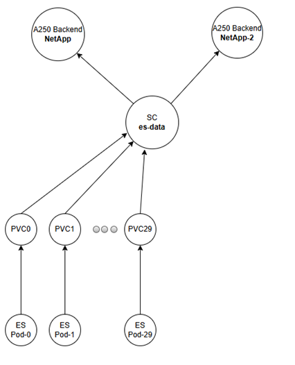

# Trident-Multi-Backend-SC: 使用單一 StorageClass 擴展多個 NetApp 後端儲存

## 專案需求

本專案旨在設定一個單一的 Kubernetes StorageClass (`es-data`)，使其能夠自動將 PersistentVolumeClaim (PVC) 的儲存請求，分配到由 NetApp Trident 管理的兩個獨立後端儲存設備上。

主要目標是為了擴展 Elasticsearch 叢集的儲存容量。透過增加節點，讓新的 Pod 可以將其 PVC 建立在新的後端儲存上，從而實現儲存空間的橫向擴展和負載平衡。

下方為本專案示意圖：



## 檔案結構

- `sc.yaml`: 定義 Kubernetes StorageClass。這是應用程式（如 Elasticsearch）在請求儲存時所使用的對象。
- `trident-backend1.yaml`: 第一個 NetApp 後端儲存的設定檔範本。
- `trident-backend2.yaml`: 第二個 NetApp 後端儲存的設定檔範本。
- `README.md`: 本說明檔案。

## 設定步驟

1.  **設定後端資訊**:
    -   編輯 `trident-backend1.yaml` 和 `trident-backend2.yaml`。
    -   將檔案中所有標示為「預留位置」的欄位（例如 `managementLIF`, `svm`, `username`, `password` 等）替換為您兩台 NetApp 儲存設備的**真實**設定資訊。

2.  **套用後端設定**:
    -   在您的 Kubernetes 環境中，使用 `kubectl` 套用這兩個後端設定。
    ```bash
    kubectl apply -f trident-backend1.yaml -n trident
    kubectl apply -f trident-backend2.yaml -n trident
    ```

3.  **驗證後端狀態**:
    -   使用 `tridentctl` 確認兩個後端都已成功上線 (`online`)。
    ```bash
    tridentctl get backends -n trident
    ```
    -   您應該會看到兩個後端，並且它們的 `STATE` 都是 `online`。

4.  **套用 StorageClass**:
    -   一旦後端準備就緒，就可以套用 StorageClass 設定。
    ```bash
    kubectl apply -f sc.yaml
    ```

5.  **驗證 StorageClass**:
    -   確認名為 `es-data` 的 StorageClass 已經成功建立。
    ```bash
    kubectl get sc es-data
    ```

完成以上步驟後，任何新的 PVC 若指定使用 `es-data` 這個 StorageClass，Trident 就會根據其內部輪詢機制，自動從 `backend-1` 或 `backend-2` 中選擇一個來提供儲存空間。

## 關鍵語法說明

這個架構的核心是透過 **標籤 (Labels)** 和 **選擇器 (Selectors)** 將 StorageClass 與多個後端儲存連接起來。

1.  **StorageClass 中的 `selector`**:
    在 `sc.yaml` 中，我們不直接指定後端，而是使用 `selector`。這會告訴 Trident：「請幫我從所有符合這個標籤的後端中，挑選一個來使用。」

    **`sc.yaml` 範例**:
    ```yaml
    apiVersion: storage.k8s.io/v1
    kind: StorageClass
    metadata:
      name: es-data
    provisioner: csi.trident.netapp.io
    parameters:
      selector: "tier=es-data" # <--- 關鍵在此
    allowVolumeExpansion: true
    reclaimPolicy: Retain
    volumeBindingMode: Immediate
    ```

2.  **後端設定中的 `labels`**:
    在 `trident-backend1.yaml` 和 `trident-backend2.yaml` 中，我們為每個後端都定義了對應的 `labels`。

    **`trident-backend1.yaml` / `trident-backend2.yaml` 範例**:
    ```yaml
    apiVersion: trident.netapp.io/v1
    kind: TridentBackendConfig
    metadata:
      name: backend-1
    spec:
      # ... 其他設定 ...
      labels:
        tier: "es-data" # <--- 標籤必須與 selector 匹配
    ```

透過這種方式，`sc.yaml` 中的 `selector: "tier=es-data"` 會自動匹配到所有 `labels` 中包含 `tier: "es-data"` 的後端，Trident 便可在这兩個後端之間進行 PVC 的自動分配。
